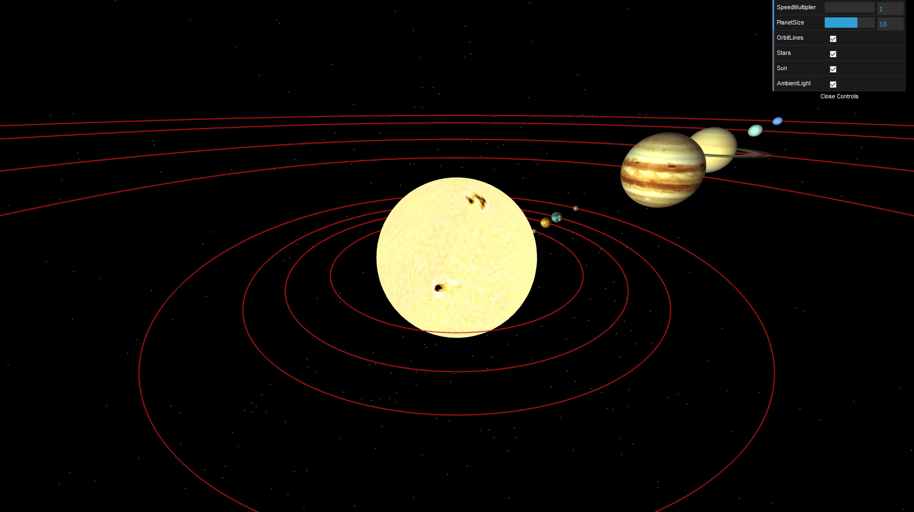

# threejs-solar-system
3D Model of our Solar System using mainly three.js library

Run npm install to install http-server and then npm start to run application.
This will automatically open the browser on localhost:8080

